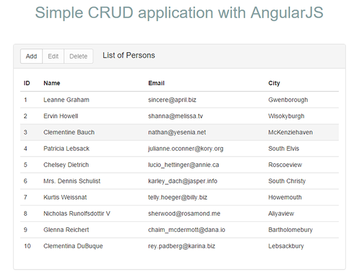
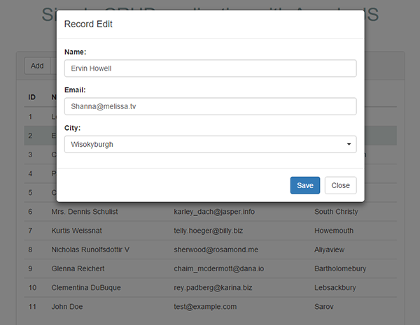
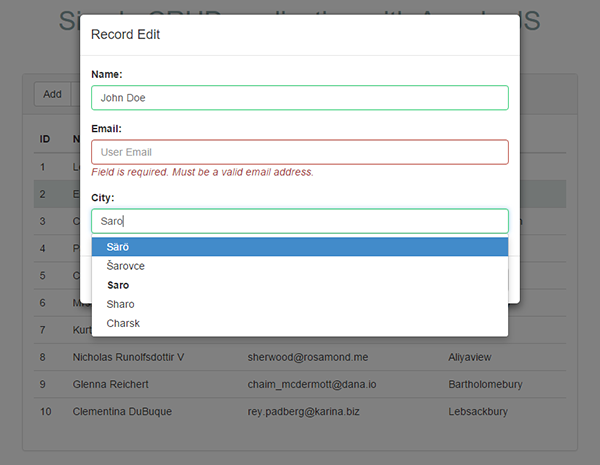

#Simple AngularJS CRUD app

##About

This project is a simple web-application for managing data on a remote service with RESTful API.

##Features

### Remote data display

The app loads data and displays it in Bootstrap table.

### CRUD operations

App can perform create, read, update and delete operations with data via Ajax. *Actually service currently used in app doesn't allow update or delete data, the app just simulates this actions.*

### Form validation

Editing form supports data validation and doesn't user allow to submit incorrect data.

##Libraries used

- [AngularJS v1.4.7](https://angularjs.org/)
- [UI Bootstrap](https://angular-ui.github.io/bootstrap/)
- [ui-select](https://github.com/angular-ui/ui-select)
- [Angular-validation](https://github.com/ghiscoding/angular-validation)

Demo data for the app acuried from [jsonplaceholder.typicode.com](http://jsonplaceholder.typicode.com/)

##ToDo

Some things to improve:

- [x] List remote data in table
- [x] Write CRUD operations code
- [x] Add a modal for creating/updating of an item
- [x] Error handling
- [x] Add form validation
- [x] Split controllers to separate files
- [ ] Make a provider for service REST URLs

